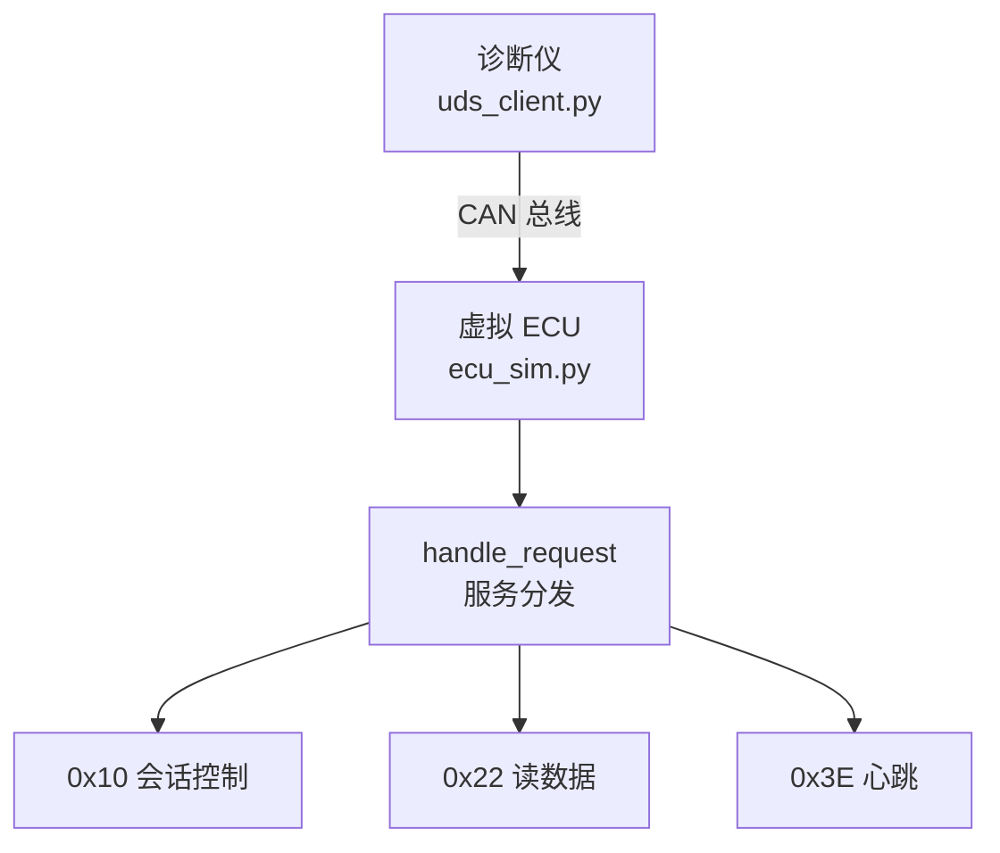

### 各模块职责

| 模块 | 文件 | 职责 |
|---|---|---|
| 诊断仪（客户端） | `uds_client.py` | `send_and_wait()` 发请求、等响应 |
| 虚拟 ECU（服务端） | `ecu_sim.py` | `handle_request()` 按服务 ID 分发 |
| 传输通道 | CAN 总线 | `udp_multicast` / `virtual` |

### 协议栈分层

| 层级 | 组件 | 职责 |
|---|---|---|
| UDS 层 | `handle_request()` | 处理 0x10 / 0x22 / 0x3E |
| ISO-TP 层 | `isotp.CanStack` | 分包、重组、流控 |
| CAN 层 | `can.Bus` | 收发原始 CAN 帧 |

## 测试

运行 `python uds_client.py test` 执行测试用例，用例定义在 `test_cases.yaml`。

当前覆盖：
- 0x10 会话控制（正常 + 异常子功能）
- 0x22 读数据（正常 + 不存在的 DID）
- 0x3E 心跳
- 未知服务

结果：7 通过，0 失败。

## 测试结果

## 支持的服务

| 服务 | 功能 | 状态 |
|---|---|---|
| 0x10 | 会话控制 | ✅ |
| 0x22 | 读数据 | ✅ |
| 0x27 | 安全访问（AES-CMAC） | ✅ |
| 0x3E | 心跳 | ✅ |