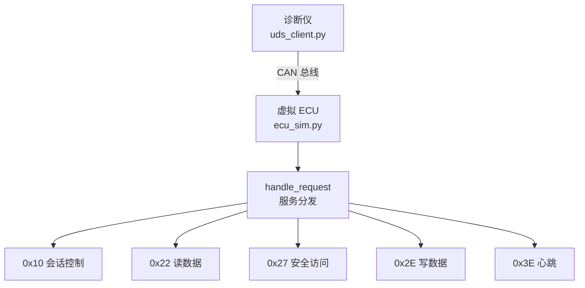

# 基于 CAN/ISO-TP/UDS 的车载诊断工具

一个用 Python 实现的 UDS 诊断客户端 + 虚拟 ECU，支持会话控制、安全访问、读写数据，并配有 YAML 配置化测试框架。

## 项目背景

车载诊断是汽车软件测试和开发的核心环节。本项目从零实现了一个 UDS 诊断工具，用于模拟诊断仪与 ECU 之间的完整交互流程，帮助理解 CAN、ISO-TP、UDS 三层协议栈的协作方式。

## 架构图



## 协议栈分层

| 层级 | 组件 | 职责 |
|---|---|---|
| UDS 层 | `handle_request()` | 处理 0x10 / 0x22 / 0x27 / 0x2E / 0x3E |
| ISO-TP 层 | `isotp.CanStack` | 分包、重组、流控 |
| CAN 层 | `can.Bus` | 收发原始 CAN 帧 |

## 支持的服务

| 服务 | 功能 | 状态 |
|---|---|---|
| 0x10 | 会话控制 | ✅ |
| 0x22 | 读数据 | ✅ |
| 0x27 | 安全访问（AES-CMAC） | ✅ |
| 0x2E | 写数据（权限控制） | ✅ |
| 0x3E | 心跳 | ✅ |

## 核心设计

- **三层协议栈**：CAN → ISO-TP → UDS，分层清晰
- **AES-CMAC 安全访问**：种子-密钥机制，预共享密钥不出总线
- **会话 + 解锁双重权限**：F190 默认会话可读，写入必须在扩展会话且解锁
- **回默认会话自动上锁**：符合 ISO 14229 规范
- **YAML 配置化测试**：13 个用例覆盖正常和异常场景，加用例不用改代码

## 环境要求

- Python 3.10+
- 依赖：

```bash
pip install python-can can-isotp cryptography pyyaml
```

## 使用方式

**终端 1：启动虚拟 ECU**

```bash
python ecu_sim.py
```

**终端 2：运行测试**

```bash
python uds_client.py test
```

**终端 2：运行正常诊断流程**

```bash
python uds_client.py
```

## 测试结果

13 个用例全部通过，覆盖：

- 0x10 会话控制（正常 + 异常子功能）
- 0x22 读数据（正常 + 不存在的 DID）
- 0x27 安全访问（请求种子 + 密钥错误 + 正确密钥解锁）
- 0x2E 写数据（默认会话被拒 + 扩展会话未解锁被拒 + 解锁后成功）
- 0x3E 心跳
- 未知服务

## 项目结构

```
PythonProject/
├── ecu_sim.py          # 虚拟 ECU（服务端）
├── uds_client.py       # 诊断客户端
├── test_cases.yaml     # 测试用例配置
├── README.md
└── docs/               # 文档和截图
```

## 技术栈

Python、python-can、can-isotp、cryptography（AES-CMAC）、PyYAML
